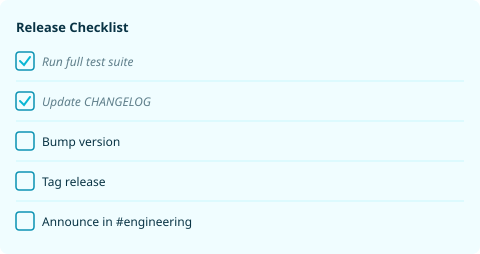
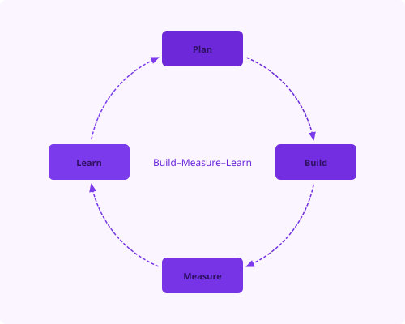
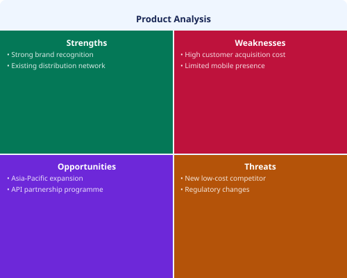
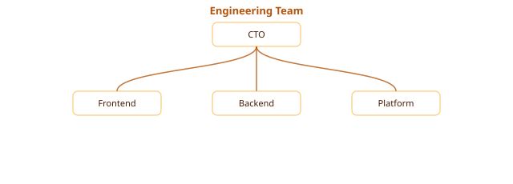
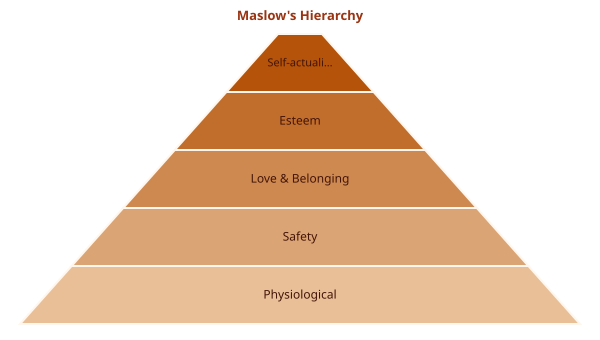
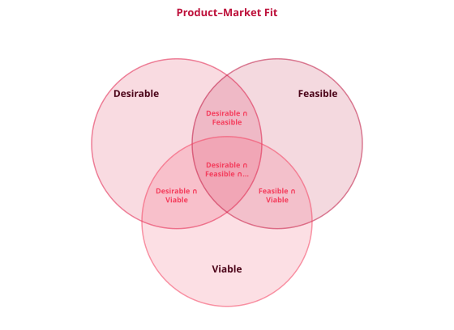
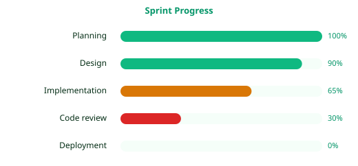
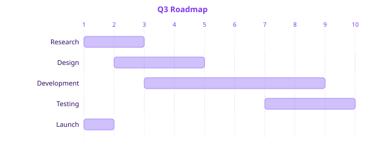
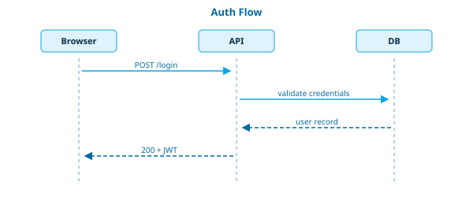
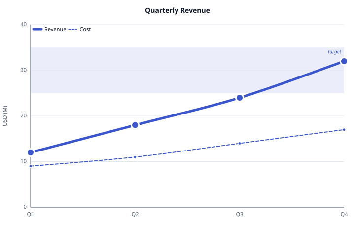

# MdArt

A markdown-native diagram DSL that renders structured diagrams as inline SVG directly from fenced code blocks.

> Eleven layout families, 100+ diagram types, all driven by a tiny indented-bullet syntax. Drop a ` ```mdart ` fence into any markdown file and you have a diagram.

## A diagram per family

One representative example for each of the eleven families. Skim what feels useful — every example is a real, valid `mdart` fence you can copy.

### Process — `chevron-process`

Sequential steps, pipelines, flows.

````markdown
```mdart
type: chevron-process
title: Development Lifecycle

Discovery → Design → Build → Test → Deploy
```
````

<picture>
  <source media="(prefers-color-scheme: dark)" srcset="./docs/examples/process.svg">
  
</picture>

---

### List — `checklist`

Items with distinct visual treatments — bullets, numbers, cards, ribbons, hexagons, checklists.

````markdown
```mdart
type: checklist
title: Release Checklist

- Run full test suite [done]
- Update CHANGELOG [done]
- Bump version
- Tag release
- Announce in #engineering
```
````

<picture>
  <source media="(prefers-color-scheme: dark)" srcset="./docs/examples/checklist.svg">
  
</picture>

---

### Cycle — `cycle`

Closed loops and recurring flows.

````markdown
```mdart
type: cycle
title: Build–Measure–Learn

Plan → Build → Measure → Learn
```
````

<picture>
  <source media="(prefers-color-scheme: dark)" srcset="./docs/examples/cycle.svg">
  
</picture>

---

### Matrix — `swot`

Quadrant views and 2-axis comparisons. Prefix chars give SWOT its four quadrants: `+` strength, `-` weakness, `?` opportunity, `!` threat.

````markdown
```mdart
type: swot
title: Product Analysis

+ Strong brand recognition
+ Existing distribution network
- High customer acquisition cost
- Limited mobile presence
? Asia-Pacific expansion
? API partnership programme
! New low-cost competitor
! Regulatory changes
```
````

<picture>
  <source media="(prefers-color-scheme: dark)" srcset="./docs/examples/swot.svg">
  
</picture>

---

### Hierarchy — `org-chart`

Org charts, trees, mind maps, decision trees.

````markdown
```mdart
type: org-chart
title: Engineering Team

- CTO
  - Frontend
  - Backend
  - Platform
```
````

<picture>
  <source media="(prefers-color-scheme: dark)" srcset="./docs/examples/org-chart.svg">
  
</picture>

---

### Pyramid — `pyramid`

Stacked tiers from base to apex.

````markdown
```mdart
type: pyramid
title: Maslow's Hierarchy

- Self-actualisation
- Esteem
- Love & Belonging
- Safety
- Physiological
```
````

<picture>
  <source media="(prefers-color-scheme: dark)" srcset="./docs/examples/pyramid.svg">
  
</picture>

---

### Relationship — `venn`

Connections and overlaps between sets. Use `∩` to declare an intersection peer.

````markdown
```mdart
type: venn
title: Product–Market Fit

- Desirable
- Feasible
- Viable
- Desirable ∩ Feasible
- Feasible ∩ Viable
- Desirable ∩ Viable
- Desirable ∩ Feasible ∩ Viable
```
````

<picture>
  <source media="(prefers-color-scheme: dark)" srcset="./docs/examples/venn.svg">
  
</picture>

---

### Statistical — `progress-list`

Numeric values rendered as bars, gauges, treemaps, sankeys, heatmaps.

````markdown
```mdart
type: progress-list
title: Sprint Progress

- Planning: 100
- Design: 90
- Implementation: 65
- Code review: 30
- Deployment: 0
```
````

<picture>
  <source media="(prefers-color-scheme: dark)" srcset="./docs/examples/progress-list.svg">
  
</picture>

---

### Planning — `gantt-lite`

Project timelines, kanban boards, work breakdown.

````markdown
```mdart
type: gantt-lite
title: Q3 Roadmap

- Research     [wk1–wk2]
- Design       [wk2–wk4]
- Development  [wk3–wk8]
- Testing      [wk7–wk9]
* Launch       [wk10]
```
````

<picture>
  <source media="(prefers-color-scheme: dark)" srcset="./docs/examples/gantt.svg">
  
</picture>

---

### Technical — `sequence`

System diagrams: sequence, state-machine, network, layered architecture, ER, class.

````markdown
```mdart
type: sequence
title: Auth Flow

- Browser
  → API: POST /login
- API
  → DB: validate credentials
- DB
  → API: user record
- API
  → Browser: 200 + JWT
```
````

<picture>
  <source media="(prefers-color-scheme: dark)" srcset="./docs/examples/sequence.svg">
  
</picture>

---

### Plot — `line-chart`

Basic x–y plots: line, scatter, area, bar. Multi-series, smoothing, shaded regions, reference lines.

````markdown
```mdart
type: line-chart
smooth: true
title: Quarterly Revenue
x: Q1, Q2, Q3, Q4
y-label: USD (M)
shade-y: 25..35 [target]

- Revenue [bold]: 12, 18, 24, 32
- Cost [dashed]: 9, 11, 14, 17
```
````

<picture>
  <source media="(prefers-color-scheme: dark)" srcset="./docs/examples/line-chart.svg">
  
</picture>

---

## Packages

| Package | Description |
|---|---|
| [`mdart`](./packages/mdart) | Core renderer and parser |
| [`mdart-marked`](./packages/mdart-marked) | [marked](https://marked.js.org) v15 extension |
| [`mdart-markdown-it`](./packages/mdart-markdown-it) | [markdown-it](https://github.com/markdown-it/markdown-it) v14 plugin |
| [`mdart-remark`](./packages/mdart-remark) | [unified](https://unifiedjs.com)/remark plugin |

## Quick start

```bash
npm install mdart
```

```ts
import { renderMdArt } from 'mdart'

const svg = renderMdArt(`
type: cycle
Plan → Build → Measure → Learn
`)

document.body.innerHTML = svg
```

Apply a theme globally or per fence:

```ts
import { configureMdArt } from 'mdart'
configureMdArt({ theme: 'mono-light' })
```

Or per fence with `theme: mono-light` in front-matter. Available themes: `mono-light` · `mono-dark` · `cyan` · `emerald` · `violet` · `lavender` · `amber` · `orange` · `rose` · `blue` · `sky`

See the individual package READMEs for markdown ecosystem integrations.

## Repository layout

```
packages/
  mdart/              # core renderer + parser
  mdart-marked/       # marked v15 extension
  mdart-markdown-it/  # markdown-it v14 plugin
  mdart-remark/       # unified/remark plugin
apps/
  playground/         # interactive browser playground
  vscode/             # VS Code extension (Marketplace: mdart)
```

## Development

```bash
# Install all dependencies
npm install

# Type-check all packages
npm run check

# Run tests
npm run test:all

# Build all packages
npm run build

# Regenerate example SVGs after renderer changes
npm run gen-examples
```

## Gallery & syntax reference

- **[docs/gallery.md](./docs/gallery.md)** — every layout type with source + rendered SVG (GitHub-friendly)
- **[docs/syntax.md](./docs/syntax.md)** — full syntax reference: front-matter keys, value types, modifier attrs, theme overrides
- **[docs/renderer-principles.md](./docs/renderer-principles.md)** — design principles for contributors building new renderers
- **[CHANGELOG.md](./CHANGELOG.md)** — release history

## License

MIT
